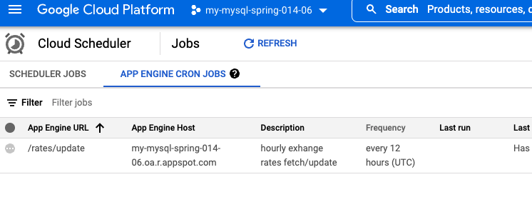

# "SpringTime" 
### Spring Boot Exercise Application

Simple application implementing couple of Spring Boot endpoints.

&copy; Jari Kinnunen, Helsinki June 17th, 2022

## How to build and run:
Some prerequisites, successfully built with these:
```
Maven: apache-maven-3.8.5
Java version: 18.0.1, vendor: Oracle Corporation
```
Source code and build
```
git clone git@github.com:jarrykinn/springtime.git
cd springtime
./mvnw package
```
or
```
./mvnw spring-javaformat:apply; mvn clean install
./mvnw spring-boot:run
```

**SpringTime** can be accessed here: http://localhost:8080/

When running in localhost, the **H2** memory based DB is in use. See `/src/main/resources/db/h2`
When starting up look for this kind of line in logs to see how to access the H2 console:
```
H2 console available at '/h2-console'. Database available at 'jdbc:h2:mem:e7b077b7-1c04-4100-8942-92ac789e9e8e'
```

## Unit tests
There are two unit test classes for the controllers:
```
TestExchangeRateController.java
TestPersonalIdentityCodeController.java
```
They can be executed e.g. like this
```
mvn test
```


## Endpoints
Following endpoints are available:

* **POST /exchange_amount**
  * Exchange money from EUR to SEK and USD and vice versa
    * `from` eg. EUR
    * `to` e.g. SEK
    * `from_amount` e.g. 10
  * the result can be read from response `to_amount`
  * `date` and `timestamp` tells when the exchange rate has been updated
```
POST http://localhost:8080/exchange_amount?from=SEK&to=EUR&from_amount=10
    Example response:
        {
            "fromCurrency": "SEK",
            "toCurrency": "EUR",
            "exchangeRate": 0.093353,
            "date": "2022-06-16",
            "timestamp": 1655403723,
            "fromAmount": 10.0,
            "to_amount": 0.93353003,
            "new": false
        }
```

* **POST /validate_ssn**
    * Validate Social Security Number
    * by the rules from here: https://dvv.fi/en/personal-identity-code
```
GET http://localhost:8080/validate_ssn
    {
      "ssn": "131052-308T",
      "country_code": "FI"
    }
    Example response:
        {
          "ssn_valid": true,
          "ssn": "131052-308T",
          "country_code": "FI"
        }
    
    Example error responses:
    Wrong checksum:
        {
          "ssn_valid": false,
          "errors": [
            {
              "field_name": "ssn",
              "rejected_value": "131052-408T",
              "message": "SSN checksum character mismatch T ≠ 1"
            }
          ]
        }
    
    Malformed SSN:
        {
          "ssn_valid": false,
          "errors": [
            {
              "field_name": "ssn",
              "rejected_value": "131052X408T",
              "message": "Malformed SSN number near: 'X408T'"
            }
          ]
        }
        
    Wrong country_code:
        {
          "ssn_valid": false,
          "errors": [
            {
              "field_name": "countryCode",
              "rejected_value": "SE",
              "message": "Only FI supported for now!"
            }
          ]
        }
}
```
Some extra endpoints:

* **GET /rates**
  * List saved exchange rates
```
GET http://localhost:8080/rates

    {
    "content": [
        {
            "fromCurrency": "EUR",
            "fullName": "",
            "toCurrency": "SEK",
            "exchangeRate": 10.7121,
            "date": "2022-06-16",
            "timestamp": 1655403723,
            "fromAmount": null,
            "toAmount": null,
            "new": false
        }, ...
```

* **GET /rates/update**
  * Trigger exchange rates update from https://apilayer.com/marketplace/description/exchangerates_data-api
  * This is also triggered by GCP Cron Job (see below)
```
GET http://localhost:8080/rates/update
    {
    "EUR > SEK": 10.700897,
    "USD > EUR": 0.9519802140432311876594440036569721996784210205078125,
    "SEK > EUR": 0.09345010983658659509121235942075145430862903594970703125,
    "SEK > USD": 0.098182,
    "USD > SEK": 10.1851663237660670091599968145601451396942138671875,
    "EUR > USD": 1.050442
    }
```
## Google Cloud Platform deployment

This service is also deployed to the GCP cloud (see `app.yaml`).
It is running in following address:
https://my-mysql-spring-014-06.oa.r.appspot.com/

It is utilizing:
* CloudSQL (MySQL)
* GCP Cron Jobs

NOTE! first call may take several seconds since the instance is not kept running all the time.

So all the endpoints works also in that host. Like:
```
POST https://my-mysql-spring-014-06.oa.r.appspot.com/exchange_amount?from=SEK&to=EUR&from_amount=10
```
or
```
GET https://my-mysql-spring-014-06.oa.r.appspot.com/validate_ssn
    {
      "ssn": "131052-308T",
      "country_code": "FI"
    }
```

The Cron Jobs are demonstarted in GCP by configuring it running there (see `cron.yaml`). It is running only every 12 hours, since running this service in GCP costs real € money ;-)


